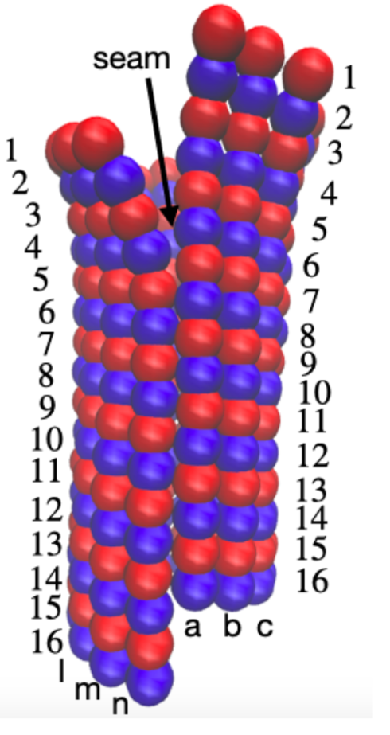

## Molecular dynamics trajectories and their analysis after mapping to a coarse-grained representation

All-atom molecular dynamics trajectories mapped to coarse-grained monomer-resolution representation are stored at google drive and can be accessed via links in `gdp-mt.url` and `gtp-mt.url`. The order of beads is as ollws:
A01, A02, A03, A04,
B01, B02, B03, B04,
C01, C02, C03, C04,
A05, A06, A07, A08,
B05, B06, B07, B08,
C05, C06, C07, C08,
A09, A10, A11, A12,
B09, B10, B11, B12,
C09, C10, C11, C12,
A13, A14, A15, A16,
B13, B14, B15, B16,
C13, C14, C15, C16,
D01, D02, D03, D04,
E01, E02, E03, E04,
F01, F02, F03, F04,
D05, D06, D07, D08,
E05, E06, E07, E08,
F05, F06, F07, F08,
D09, D10, D11, D12,
E09, E10, E11, E12,
F09, F10, F11, F12,
D13, D14, D15, D16,
E13, E14, E15, E16,
F13, F14, F15, F16,
G01, G02, G03, G04,
H01, H02, H03, H04,
I01, I02, I03, I04,
G05, G06, G07, G08,
H05, H06, H07, H08,
I05, I06, I07, I08,
G09, G10, G11, G12,
H09, H10, H11, H12,
I09, I10, I11, I12,
G13, G14, G15, G16,
H13, H14, H15, H16,
I13, I14, I15, I16,
J01, J02, J03, J04,
K01, K02, K03, K04,
L01, L02, L03, L04,
J05, J06, J07, J08,
K05, K06, K07, K08,
L05, L06, L07, L08,
J09, J10, J11, J12,
K09, K10, K11, K12,
L09, L10, L11, L12,
J13, J14, J15, J16,
K13, K14, K15, K16,
L13, L14, L15, L16,
M01, M02, M03, M04,
N01, N02, N03, N04,
M05, M06, M07, M08,
N05, N06, N07, N08,
M09, M10, M11, M12,
N09, N10, N11, N12,
M13, M14, M15, M16,
N13, N14, N15, N16
